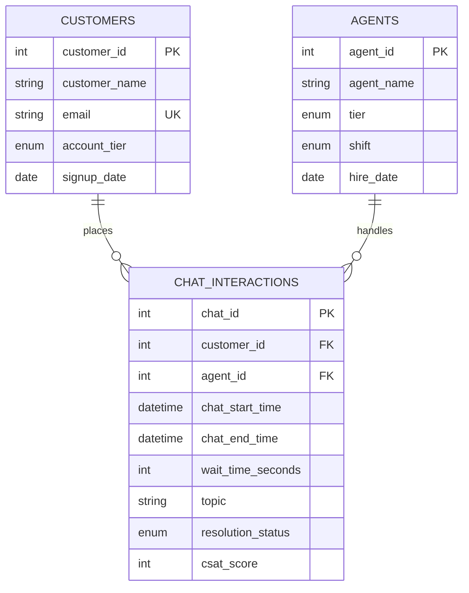

# 📊 Customer Support Operations & Chat Performance Analytics (MySQL)

An end-to-end SQL analytics project evaluating workforce efficiency, queue dynamics, customer satisfaction (CSAT), and Service Level Agreement (SLA) adherence across 1,200+ chat interactions.

---

## 📌 Executive Summary & Business Objective

Support operations teams often face conflicting pressures: minimizing customer wait times and handle times while maintaining high resolution rates and customer satisfaction. 

This project explores operational friction points using a relational database modeled in **MySQL 8.0**. Key business goals include:
1. Identifying workload and performance disparities across shifts (**Morning, Evening, Night**).
2. Measuring First-Contact Resolution (FCR) and ticket escalation rates by contact driver.
3. Ranking agent performance equitably using multi-partition window functions.
4. Detecting repeat customer contacts within rolling 24-hour windows.
5. Evaluating SLA queue breaches across customer account tiers (**Free, Pro, Enterprise**).
6. Analyzing hourly chat arrival heatmaps to guide workforce staffing.

---

## 🏗️ Relational Schema & Data Architecture

The project consists of three core tables enforcing primary keys, foreign keys, `ENUM` types for clean categorical grouping, and `CHECK` constraints for data integrity.

## 🛠️ Tech Stack & SQL Concepts Applied

* **RDBMS:** MySQL 8.0+
* **Data Aggregation & Grouping:** Multi-level `GROUP BY`, `COUNT(DISTINCT)`, `AVG()`, `ROUND()`
* **Conditional Aggregation:** `SUM(CASE WHEN ...)` to compute resolution, escalation, and SLA breach rates in a single scan.
* **Window Functions:** 
  * `ROW_NUMBER()` / `DENSE_RANK()` with `PARTITION BY` for localized shift rankings.
  * `LAG()` for chronological, cross-row customer touchpoint tracking.
* **Modular Code Structure:** Common Table Expressions (**CTEs**) for separation of base aggregations from ratio calculations.
* **Defensive Calculations:** `NULLIF()` to eliminate division-by-zero risks on dynamic denominators.
* **Temporal Calculations:** `TIMESTAMPDIFF()` for accurate minute-based Average Handle Time (AHT) and `HOUR()` for queue arrival clustering.

---
